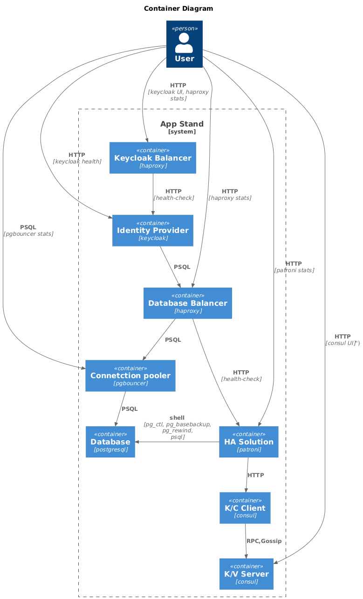
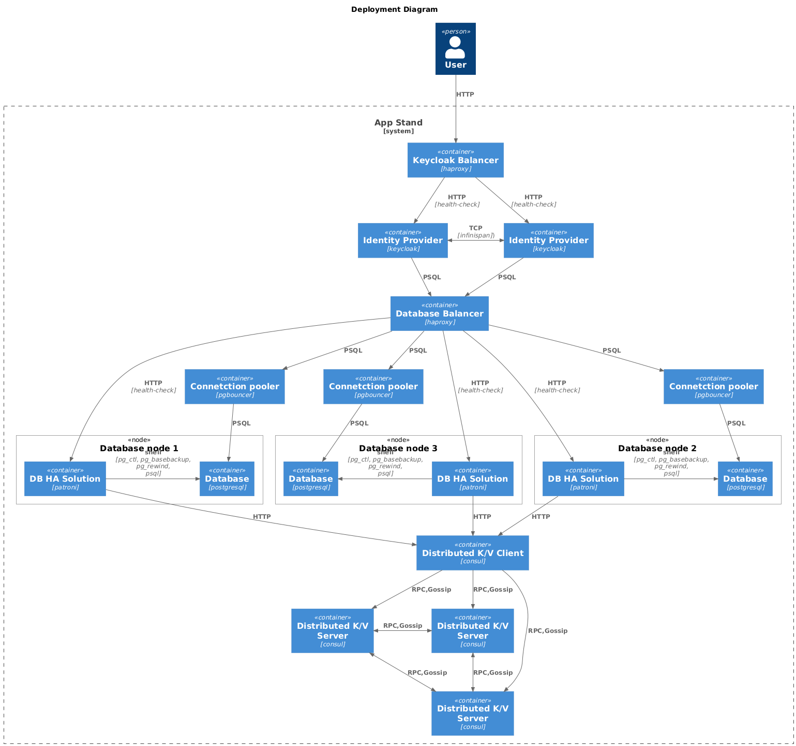

# Demo project of Keycloak and PostgreSQL in high availability configuration

This project is a demo of Keycloak and PostgreSQL in high availability configuration.

## 📋 Overview

### Key Features

* One-Click Deployment - Simplify your setup process with a single command: docker compose up -d. No complex configurations or multiple steps required.
* Auto-Configuration - Enjoy seamless out-of-the-box experience. All necessary settings are automatically configured, eliminating the need for manual adjustments.
* Containerized Solution - Leverage Docker for consistent and reliable deployments across any environment.
* Educational Environment - Perfect for learning and experimentation. Provides a safe and controlled lab environment for studying system behavior, testing new ideas, and gaining hands-on experience.

### 🏗️ Components

* **Keycloak** - Open Source Identity and Access Management solution
* **PostgreSQL** - Relational database system
* **Patroni** - High Availability and failover for PostgreSQL
* **PgBouncer** - Connection pooler for PostgreSQL
* **HAProxy** - Load balancer and proxy server
* **Consul** - Service mesh and service discovery
* **Prometheus** - Monitoring and alerting system
* **Grafana** - Open source analytics and monitoring solution
* **Loki** - Open source log aggregation and monitoring system

### 📊 Diagrams

## 🛠️ Installation

### Requirements

- Docker
- Docker Compose
- Docker plugin loki-docker-driver
- Minimal 2 Cores and 4GB free RAM

### Getting Started

1. Install docker plugin loki-docker-driver `docker plugin install grafana/loki-docker-driver --alias loki --grant-all-permissions`
2. Clone the project repository
3. Move to the project directory
4. Run `docker-compose up -d`
5. Open http://localhost in your browser

## System Endpoints Overview

### Monitoring and Management Endpoints

* **Consul UI** - http://\<consul\>:8500
  * Web interface for managing and monitoring Consul services

* **Keycloak UI** - http://localhost, http://\<keycloak\>:8081
  * Centralized identity and access management platform

* **HAProxy Statistics Dashboard** - http://\<haproxy\>:7000
  * Real-time monitoring of HAProxy performance

* **Keycloak Health Check** - http://\<keycloak\>:9000
  * Endpoint for checking Keycloak service health status

* **Patroni Cluster Information** - http://\<patroni\>:8008/\<master/replica/health\>
  * Cluster status and health monitoring for PostgreSQL

* **PgBouncer Statistics** - SHOW SQL commands
  * The console is available by connecting as normal to the database pgbouncer
* **Grafana** - http://localhost:3000, http://\<grafana\>:3000
  * Dashboard for monitoring and alerting
* **Prometheus** - http://localhost:9090, http://\<prometheus\>:9090
  * Prometheus monitoring system

## License

This project is licensed under the MIT License - see the LICENSE file for details.
