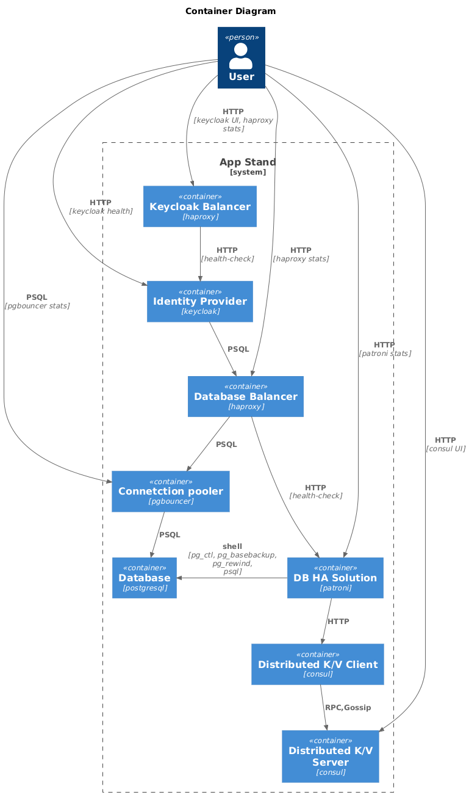

# Demo project of Keycloak and PostgreSQL in high availability configuration

This project is a demo of Keycloak and PostgreSQL in high availability configuration.

## 📋 Overview

### Key Features

* **Automated Failover** using Patroni
* **Load Balancing** with HAProxy
* **Connection Pooling** via PgBouncer
* **Service Discovery** using Consul

## 🏗️ Components

* **Keycloak** - Open Source Identity and Access Management solution
* **PostgreSQL** - Relational database system
* **Patroni** - High Availability and failover for PostgreSQL
* **PgBouncer** - Connection pooler for PostgreSQL
* **HAProxy** - Load balancer and proxy server
* **Consul** - Service mesh and service discovery

## 📊 Diagrams

## 🛠️ Installation

### Requirements

- Docker
- Docker Compose

### Getting Started

1. Clone the repository
2. Run `docker-compose up -d`
3. Open http://localhost in your browser

## System Endpoints Overview

### Monitoring and Management Endpoints

* **Consul UI** - http://\<consul\>:8500
  * Web interface for managing and monitoring Consul services

* **Keycloak UI** - http://localhost, http://\<keycloak\>:8081
  * Centralized identity and access management platform

* **HAProxy Statistics Dashboard** - http://\<haproxy\>:7000
  * Real-time monitoring of HAProxy performance

* **Keycloak Health Check** - http://\<keycloak\>:9000
  * Endpoint for checking Keycloak service health status

* **Patroni Cluster Information** - http://\<patroni\>:8008/\<master/replica/health\>
  * Cluster status and health monitoring for PostgreSQL

* **PgBouncer Statistics** - SHOW SQL commands
  * The console is available by connecting as normal to the database pgbouncer

## License

This project is licensed under the MIT License - see the LICENSE file for details.
